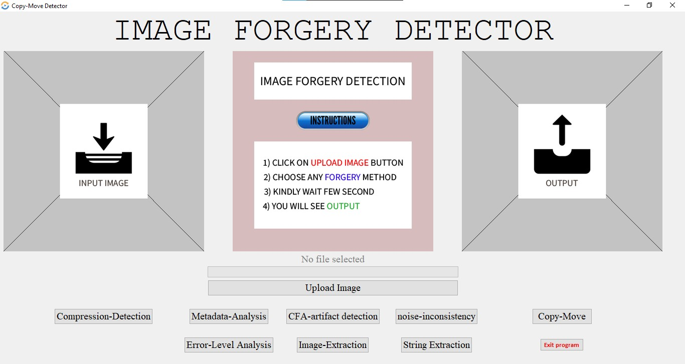
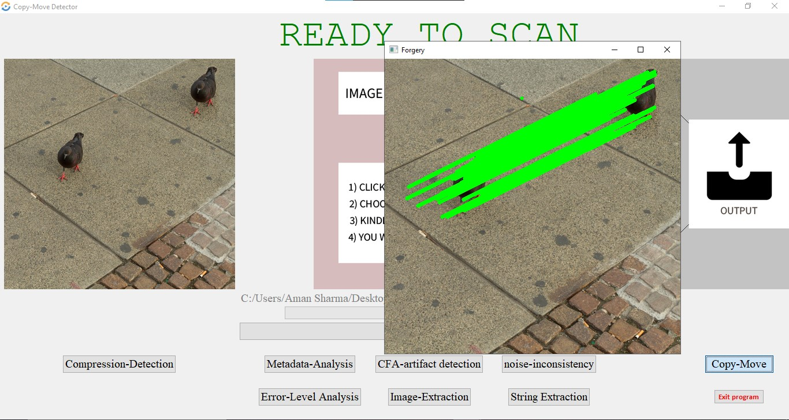

# Multimedia Forensics Detection System (Image, Audio & Video)

## 🎯 Overview
In today's technical world, digital media (images, audio, and video) are vital parts of many application domains. The meaning of media forgery is the manipulation of digital media to hide important information or output false information. Due to the introduction of modern multimedia processing tools, digital media forgery is at its peak.

This comprehensive system detects manipulation and forgery in:
- **📷 Images** - JPEG, PNG formats
- **🎵 Audio** - WAV, MP3, FLAC, OGG formats  
- **🎬 Video** - MP4, AVI, MOV, MKV formats

## ✨ Features

### Image Forgery Detection
The forgery detection tool features forensic methods to detect:

- **Double JPEG compression** - Identifies re-saved images
- **Copy-move forgeries** - Detects duplicated regions
- **Metadata Analysis** - Extracts and analyzes EXIF data
- **CFA artifacts** - Color Filter Array inconsistencies
- **Noise variance inconsistencies** - Uneven noise patterns
- **Error Level Analysis** - Highlights manipulated areas
- **Image Extraction** - Steganography detection
- **String Extraction** - Hidden text in files

### 🎵 Audio Forensics (NEW!)
Advanced audio manipulation detection:

- **Splicing Detection** - Identifies audio cuts and edits
- **Clipping Detection** - Detects over-amplification
- **Noise Pattern Analysis** - Inconsistent background noise
- **Resampling Detection** - Quality reduction indicators
- **Compression Artifacts** - Re-encoding detection
- **Metadata Extraction** - Comprehensive audio file info

### 🎬 Video Forensics (NEW!)
Comprehensive video manipulation analysis:

- **Frame Duplication** - Detects frozen/repeated frames
- **Inter-Frame Forgery** - Temporal inconsistencies
- **Copy-Move Detection** - Duplicated regions in frames
- **Double Compression** - Re-encoding artifacts
- **Noise Consistency** - Frame-by-frame noise analysis
- **Frame Rate Anomalies** - Irregular timing detection
- **Metadata Analysis** - Video file forensics

## 🚀 Quick Start

### Installation
```bash
# Install all dependencies
pip install -r requirements.txt
```

### Run the GUI
```bash
python GUI.py
```

### Run Tests
```bash
python test_multimedia.py
```

## 📖 Documentation

- **[QUICK_START.md](QUICK_START.md)** - Fast setup and basic usage
- **[MULTIMEDIA_GUIDE.md](MULTIMEDIA_GUIDE.md)** - Comprehensive documentation
- **[Research Paper](https://journals.grdpublications.com/index.php/ijprse/article/view/537/507)** - Original research

## 💻 Usage

### GUI Application (Recommended)
```bash
python GUI.py
```

1. **Upload Image/Audio/Video** - Select your media file
2. **Choose Analysis** - Click the appropriate forensics button
3. **View Results** - Analysis reports open automatically

## 🔧 Requirements

- Python 3.8+
- NumPy, OpenCV, Scikit-learn, SciPy
- **NEW:** Librosa, Soundfile, Mutagen (for audio)
- **NEW:** FFmpeg-python (for enhanced video metadata)

See `requirements.txt` for complete list.

## 📊 Detection Methods

### Image Algorithms
- SIFT feature detection with DBSCAN clustering
- DCT coefficient analysis
- Metadata extraction and validation
- Statistical noise analysis

### Audio Algorithms (NEW)
- Short-Time Fourier Transform (STFT) analysis
- Spectral discontinuity detection
- MFCC-based compression analysis
- Power spectral density examination

### Video Algorithms (NEW)
- SIFT-based frame analysis
- Temporal consistency checking
- DCT-based compression detection
- Frame correlation analysis

## 🎯 Accuracy & Performance

- **Images:** Real-time analysis (<5 seconds)
- **Audio:** 10-30 seconds per file
- **Video:** 1-5 minutes depending on length
- **Accuracy:** Multi-indicator verdict system (see documentation)

## 📸 Screenshots



*Note: GUI now includes audio and video upload/analysis buttons*

## 🆕 What's New in Version 2.0

- ✅ Complete audio forensics suite
- ✅ Complete video forensics suite
- ✅ Enhanced GUI with multimedia support
- ✅ Comprehensive reporting system
- ✅ Test suite for verification
- ✅ Detailed documentation

## 🤝 Contributing

This is an enhanced version of the original Image Manipulation Detection System with added multimedia capabilities.

## 📄 License

Please refer to original project license terms.

## 🙏 Credits

- Original Image Forensics System
- Enhanced with Audio & Video Forensics by adding librosa, soundfile, and advanced OpenCV techniques
- Research paper reference: [IJPRSE Journal](https://journals.grdpublications.com/index.php/ijprse/article/view/537/507)

## 🆘 Support

For issues and questions:
1. Check `QUICK_START.md` for common solutions
2. See `MULTIMEDIA_GUIDE.md` for detailed help